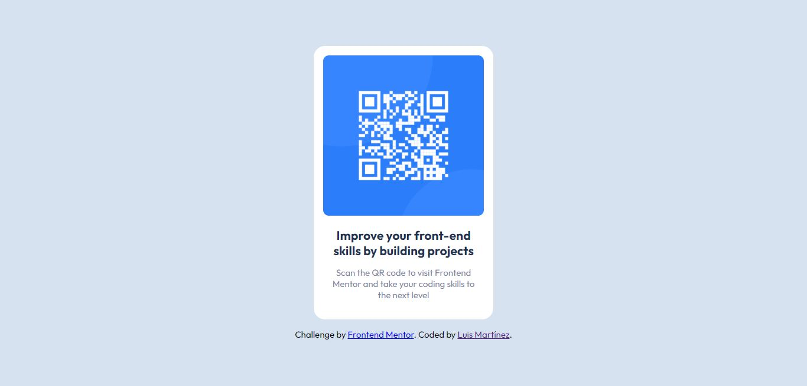

# Frontend Mentor - QR code component solution

This is a solution to the [QR code component challenge on Frontend Mentor](https://www.frontendmentor.io/challenges/qr-code-component-iux_sIO_H). Frontend Mentor challenges help you improve your coding skills by building realistic projects. 

## Table of contents

- [Overview](#overview)
  - [Screenshot](#screenshot)
  - [Links](#links)
- [My process](#my-process)
  - [Built with](#built-with)
  - [Continued development](#continued-development)
- [Author](#author)

## Overview

### Screenshot

### Links

- Solution URL: [GitHub](https://github.com/lemartinezm/qr-code-component)
- Live Site URL: [Vercel](https://qr-code-component-livid.vercel.app/)

## My process

### Built with

- HTML
- SCSS
- Flexbox

### Continued development

* SASS/SCSS

## Author

- Frontend Mentor - [@lemartinezm](https://www.frontendmentor.io/profile/lemartinezm)
- Twitter - [@Luis14151617](https://twitter.com/Luis14151617)
